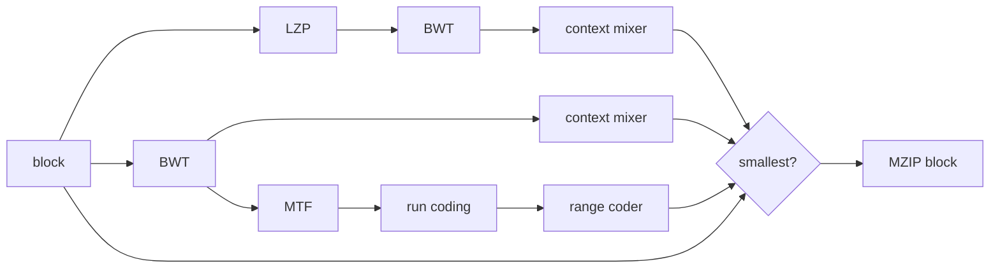

# How mzip works

The input is split into independent blocks. Larger blocks give the sort more context to
exploit and noticeably improve text compression, so the block size scales with the input:
4 MiB for small inputs, one sixteenth of the input for larger ones, capped at 16 MiB so big
files always split into enough blocks for the thread pool. `--block-size` (1 KiB to 1 GiB)
overrides the automatic choice, and `--profile ratio` puts the whole input in one block,
capped at 1 GiB.
Every block runs through the pipeline below, and the encoder keeps whichever complete
representation is smallest: the context-mixed block with or without an LZP pass in front,
the move-to-front path, or the raw bytes. The raw fallback means an archive can never grow
by more than the per-block headers.

Multi-block inputs up to 512 MiB are buffered and run through one stream-wide LZP pass
first; the blocks then cover the collapsed stream. A decisive shrink commits to the pass; a
marginal one builds both archives and keeps the smaller.

## LZP

Long exact repeats collapse before the BWT. A table of 2^20 positions, indexed by a hash of
the previous 8 bytes, predicts where the same context last occurred; when at least 128 bytes
match that position, the repeat becomes a marker plus a length. The marker is the block's
rarest byte and is stored as the first byte of the stream, literal occurrences of it are
escaped with a zero length, and lengths are base-128 varints. Short matches are left for
the BWT; the pass is kept per block only when the final payload gets smaller.

The same transform runs in two places. Per block it competes as a pipeline candidate with a
2^20 table. Stream-wide it runs once over the whole buffered input with a table scaled to
the data (2^20 to 2^26 slots), collapsing repeats between blocks; the decoder undoes it in
one sequential pass at the end and checks an Adler-32 of the restored input from the stream
header.

## Burrows-Wheeler transform

The BWT sorts all rotations of the block so that bytes with similar right-context end up
adjacent, which is what makes the later stages effective. Sorting is done through a suffix
array built with SA-IS (Nong, Zhang, Chan, 2009): positions are classified S/L, LMS
substrings are sorted by one round of induced sorting, named, and the algorithm recurses on
the reduced string only when names repeat. Construction is `O(n)` time and memory, all in
32-bit indices since blocks are at most 64 MiB.

The block is transformed against a virtual sentinel that sorts below every byte. The output
row whose preceding character would be the sentinel is omitted; its row number (1..n) is
stored in the block header as the primary index and the inverse transform is a standard
LF-mapping walk.

## Move-to-front

An array of 256 byte values, most recently seen first. Each input byte is replaced by its
current position and moved to the front. After the BWT, this produces a stream dominated by
zeros and small values. Worst case `O(256n)`, in practice close to linear because hot symbols
sit near the front.

## Run coding

The MTF stream is mapped onto a 259-symbol alphabet:

| Symbol             | Meaning                                            |
|--------------------|----------------------------------------------------|
| 0 (RUNA), 1 (RUNB) | digits of a zero-run length in bijective base 2    |
| 2 (RUNC), 3 (RUND) | digits of a repeat count for the preceding literal |
| 4..258             | literal for byte value `symbol - 3` (1..255)       |

Zero runs use the bzip2 RLE0 scheme: bijective base-2 digits, least significant first, no
terminator needed. RUNC/RUND apply the same idea to repeats of non-zero literals, which
matters for structured binary data (spreadsheets, bitmaps) where MTF leaves long runs of 1s
and 2s that plain RLE0 would emit symbol by symbol.

A repeat of length k can be spelled either as k literals or as one literal plus RUNC/RUND
digits; both decode identically. The encoder builds one candidate that switches to digits at
run length 2 and one at run length 3, then keeps whichever serializes smaller — the
aggressive spelling wins on binary data, the conservative one on text, and the choice costs
nothing in the format.

## Adaptive range coding

The run symbols are compressed with a binary range coder (the LZMA construction: 32-bit
range, carry propagation through a byte cache) driven by adaptive 12-bit probabilities.
Each symbol is decomposed into a few binary decisions — zero-run digit or not, run digit
values, and a bit tree for literal bytes — and every decision has its own probability
selected by context:

- the class of the previous symbol, for the zero-run decision;
- the digit index within the current run spelling, for RUNA/RUNB and RUNC/RUND values;
- the magnitude of the previous literal crossed with "a zero run just ended", for the
  literal bit tree (small MTF ranks predict small successors, which is where DNA-like data
  wins).

All contexts are functions of already coded symbols, so the decoder tracks the same state
and the archive stores no tables at all. Probabilities start at one half and adapt as the
block streams through, which handles data whose statistics drift mid-block — exactly what a
static table cannot do. Since RUNC/RUND decisions are only coded where the grammar allows
them, the decoder can only ever produce well-formed run streams.

## Context mixing

The other coder models BWT output directly, one bit at a time through a byte tree. Three
counters are blended with fixed weights — order-0, order-1 keyed by the previous byte, and
order-1 keyed by the byte before that, mixed 7:7:2 — and the blend passes through an
adaptive probability map of 17 interpolated cells per context, keyed by the tree node and a
flag for "the last three bytes were equal", which stands in for run modeling. The stages
adapt at different rates (fastest for order-0, slowest for the map); the bit itself goes
through a carryless 32-bit arithmetic coder. Either coder can win the per-block comparison:
text and binaries usually go to the mixer, structured spreadsheet-like data to
move-to-front.

## Parallel blocks

Blocks are independent, so the compressor reads them in file order and hands each in-flight
block to a dedicated worker thread, draining results in the same order. A worker holds the
block plus suffix-array scratch (roughly 15x the block size), so the number of blocks in
flight shrinks as blocks grow, keeping peak memory around two gigabytes at worst. The
archive layout never depends on scheduling: any thread count produces the same bytes.
Decompression mirrors the same pipeline: payloads are read in archive order, decoded on
workers, and written back in order, so the restored bytes never depend on scheduling either.

## Container format

All integers are little-endian. The decoder rejects unknown versions, non-zero reserved
fields, impossible sizes, out-of-range BWT indices, malformed run or range-coded streams,
trailing data, and checksum mismatches. Declared sizes are used as hard bounds before any
allocation.

File header (24 bytes):

| Field            | Size | Description                                          |
|------------------|-----:|------------------------------------------------------|
| Magic            |    4 | ASCII `MZIP`                                         |
| Version          |    1 | `2`; version 1 archives are still read               |
| Flags + reserved |    3 | first byte: bit 0 marks a directory archive, bit 1 a |
|                  |      | stream LZP pass; everything else must be zero        |
| Block size       |    4 | maximum coded bytes per block                        |
| Original size    |    8 | total uncompressed size                              |
| Block count      |    4 | must match the coded stream and block size           |

With flag bit 1 a 16-byte stream header follows, and the blocks cover the LZP stream
instead of the raw input:

| Field       | Size | Description                                    |
|-------------|-----:|------------------------------------------------|
| Stream size |    8 | LZP stream length; strictly below the original |
| Adler-32    |    4 | checksum of the whole original input           |
| Hash bits   |    1 | table size, 20..26                             |
| Reserved    |    3 | must be zero                                   |

A directory archive's decompressed stream is a tar tree (ustar with GNU long-name entries
and base-256 sizes where the classic fields run out) generated on the fly during
compression, so no temporary tar ever exists on disk. Entries are sorted and carry fixed
metadata, which keeps directory archives byte-reproducible. On extraction every stored path
is validated - absolute paths and `..` components are rejected - and the tree is extracted
into a temporary sibling directory that is renamed into place only when the whole archive
checks out.

Block header (24 bytes):

| Field             | Size | Description                                             |
|-------------------|-----:|---------------------------------------------------------|
| Mode + flags      |    4 | mode `0` raw, `1` move-to-front, `2` context-mixed;     |
|                   |      | flag bit 0 marks an LZP pass, the rest must be zero     |
| Original size     |    4 | coded-stream bytes this block restores                  |
| Payload size      |    4 | bytes following the header                              |
| BWT primary index |    4 | sentinel row, 1..n; zero for raw blocks                 |
| Intermediate size |    4 | run coding symbol count for mode 1; LZP stream size for |
|                   |      | mode 2 with the LZP flag, zero otherwise                |
| Adler-32          |    4 | checksum of the block's coded-stream slice              |

A compressed payload is a single coded stream; every model is rebuilt from scratch on both
sides, so no tables are stored. The decoder must consume the payload exactly, and the
intermediate size bounds what it will produce. LZP only ever combines with the context
mixer, and an LZP stream must be strictly smaller than the block it restores.

## Limitations

- Compression tries several complete codings per block, and the context mixer works bit by
  bit; parallel blocks absorb most of the cost on multi-core machines.
- The context mixer decodes at roughly the speed it encodes; decompression is not much
  faster than compression on mixer-heavy data.
- x86 code compresses without any branch-target filtering; xz still wins on executables.
- Adler-32 catches accidental corruption, not deliberate tampering.
- The stream LZP pass buffers the input, so it is skipped above 512 MiB; larger inputs rely
  on the per-block stages and stream through fixed memory as before.
- The format is versioned; versions 1 and 2 exist, the encoder writes 2 and the decoder
  reads both. No forward-compatibility promises.
