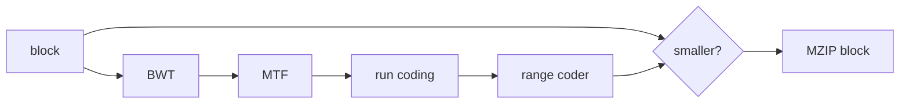

# How mzip works

The input is split into independent blocks. Larger blocks give the sort more context to
exploit and noticeably improve text compression, so the block size scales with the input:
4 MiB for small inputs, one sixteenth of the input for larger ones, capped at 16 MiB so big
files always split into enough blocks for the thread pool. `--block-size` (1 KiB to 64 MiB)
overrides the automatic choice; blocks above 16 MiB squeeze out a little more ratio at the
cost of parallelism and memory. Every block runs through the transform pipeline below, and
the encoder writes whichever complete representation is smaller: the transformed payload or
the raw bytes. Raw fallback means an archive can never grow by more than the per-block
headers.

## Burrows-Wheeler transform

The BWT sorts all rotations of the block so that bytes with similar right-context end up
adjacent, which is what makes the later stages effective. Sorting is done through a suffix
array built with SA-IS (Nong, Zhang, Chan, 2009): positions are classified S/L, LMS
substrings are sorted by one round of induced sorting, named, and the algorithm recurses on
the reduced string only when names repeat. Construction is `O(n)` time and memory, all in
32-bit indices since blocks are at most 64 MiB.

The block is transformed against a virtual sentinel that sorts below every byte. The output
row whose preceding character would be the sentinel is omitted; its row number (1..n) is
stored in the block header as the primary index and the inverse transform is a standard
LF-mapping walk.

## Move-to-front

An array of 256 byte values, most recently seen first. Each input byte is replaced by its
current position and moved to the front. After the BWT, this produces a stream dominated by
zeros and small values. Worst case `O(256n)`, in practice close to linear because hot symbols
sit near the front.

## Run coding

The MTF stream is mapped onto a 259-symbol alphabet:

| Symbol             | Meaning                                            |
|--------------------|----------------------------------------------------|
| 0 (RUNA), 1 (RUNB) | digits of a zero-run length in bijective base 2    |
| 2 (RUNC), 3 (RUND) | digits of a repeat count for the preceding literal |
| 4..258             | literal for byte value `symbol - 3` (1..255)       |

Zero runs use the bzip2 RLE0 scheme: bijective base-2 digits, least significant first, no
terminator needed. RUNC/RUND apply the same idea to repeats of non-zero literals, which
matters for structured binary data (spreadsheets, bitmaps) where MTF leaves long runs of 1s
and 2s that plain RLE0 would emit symbol by symbol.

A repeat of length k can be spelled either as k literals or as one literal plus RUNC/RUND
digits; both decode identically. The encoder builds one candidate that switches to digits at
run length 2 and one at run length 3, then keeps whichever serializes smaller — the
aggressive spelling wins on binary data, the conservative one on text, and the choice costs
nothing in the format.

## Adaptive range coding

The run symbols are compressed with a binary range coder (the LZMA construction: 32-bit
range, carry propagation through a byte cache) driven by adaptive 12-bit probabilities.
Each symbol is decomposed into a few binary decisions — zero-run digit or not, run digit
values, and a bit tree for literal bytes — and every decision has its own probability
selected by context:

- the class of the previous symbol, for the zero-run decision;
- the digit index within the current run spelling, for RUNA/RUNB and RUNC/RUND values;
- the magnitude of the previous literal crossed with "a zero run just ended", for the
  literal bit tree (small MTF ranks predict small successors, which is where DNA-like data
  wins).

All contexts are functions of already coded symbols, so the decoder tracks the same state
and the archive stores no tables at all. Probabilities start at one half and adapt as the
block streams through, which handles data whose statistics drift mid-block — exactly what a
static table cannot do. Since RUNC/RUND decisions are only coded where the grammar allows
them, the decoder can only ever produce well-formed run streams.

## Parallel blocks

Blocks are independent, so the compressor reads them in file order and hands them to a
bounded pool of worker threads, draining results in the same order. A worker holds the block
plus suffix-array scratch (roughly 15x the block size), so the number of blocks in flight
shrinks as blocks grow, keeping peak memory near a gigabyte regardless of settings. The
archive layout never depends on scheduling: any thread count produces the same bytes.
Decompression is currently single-threaded; the inverse BWT walk dominates its runtime.

## Container format

All integers are little-endian. The decoder rejects unknown versions, non-zero reserved
fields, impossible sizes, out-of-range BWT indices, malformed run or range-coded streams,
trailing data, and checksum mismatches. Declared sizes are used as hard bounds before any
allocation.

File header (24 bytes):

| Field            | Size | Description                      |
|------------------|-----:|----------------------------------|
| Magic            |    4 | ASCII `MZIP`                     |
| Version          |    1 | `1`                              |
| Flags + reserved |    3 | must be zero                     |
| Block size       |    4 | maximum original bytes per block |
| Original size    |    8 | total uncompressed size          |
| Block count      |    4 | must match size and block size   |

Block header (24 bytes):

| Field             | Size | Description                             |
|-------------------|-----:|-----------------------------------------|
| Mode + reserved   |    4 | `0` raw, `1` transformed                |
| Original size     |    4 | uncompressed bytes in this block        |
| Payload size      |    4 | bytes following the header              |
| BWT primary index |    4 | sentinel row, 1..n; zero for raw blocks |
| Intermediate size |    4 | run coding symbol count                 |
| Adler-32          |    4 | checksum of the original block          |

A transformed payload is a single range-coded stream; the model is rebuilt from scratch on
both sides, so no tables are stored. The decoder must consume the payload exactly, and the
intermediate size bounds how many symbols it will produce.

## Limitations

- Decompression is single-threaded and dominated by the cache-unfriendly inverse BWT, which
  gets slower as blocks grow; ratio and decompression speed trade off through `--block-size`.
- xz still wins on LZMA-friendly binary data with long repeated records.
- Adler-32 catches accidental corruption, not deliberate tampering.
- The format is versioned but only version 1 exists; no forward-compatibility promises.
