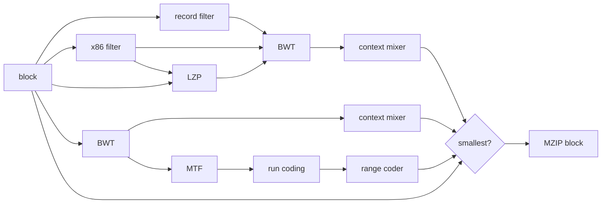

# How mzip works

The input is split into independent blocks. Larger blocks give the sort more context to
exploit and noticeably improve compression, so blocks are 16 MiB by default: inputs up to
that size are coded whole, and bigger files split into enough blocks for the thread pool at
a bounded memory cost per block. `--block-size` (1 KiB to 1 GiB) overrides the automatic
choice, and `--profile ratio` puts the whole input in one block, capped at 1 GiB. A block
whose content changes part-way, say from machine code to data tables, is cut at the change
and its pieces are coded as blocks of their own (see content boundaries below).
Every block runs through the pipeline below, and the encoder keeps whichever complete
representation is smallest: the context-mixed block with or without an LZP pass in front,
the same two with the x86 branch-target filter applied first when the block looks like
machine code, the context-mixed block after the record filter when the block holds
fixed-length records, the move-to-front path, or the raw bytes. The raw fallback means an archive
can never grow by more than the per-block headers.

Multi-block inputs up to 512 MiB are buffered and run through one stream-wide LZP pass
first; the blocks then cover the collapsed stream. A decisive shrink commits to the pass; a
marginal one builds both archives and keeps the smaller.

```mermaid
flowchart LR
    A[block] --> X[x86 filter] --> L
    A --> L[LZP]
    A --> R[record filter] --> B2
    X --> B2
    L --> B2[BWT] --> M2[context mixer] --> F
    A --> B1[BWT]
    B1 --> M1[context mixer] --> F
    B1 --> C[MTF] --> D[run coding] --> E[range coder] --> F
    A --> F{smallest?}
    F --> G[MZIP block]
```

## LZP

Long exact repeats collapse before the BWT. A table of 2^20 positions, indexed by a hash of
the previous 8 bytes, predicts where the same context last occurred; when at least 128 bytes
match that position, the repeat becomes a marker plus a length. The marker is the block's
rarest byte and is stored as the first byte of the stream, literal occurrences of it are
escaped with a zero length, and lengths are base-128 varints. Short matches are left for
the BWT; the pass is kept per block only when the final payload gets smaller.

The same transform runs in two places. Per block it competes as a pipeline candidate with a
2^20 table. Stream-wide it runs once over the whole buffered input with a table scaled to
the data (2^20 to 2^26 slots), collapsing repeats between blocks. There, in version 3, a
repeat whose source lies at least one block back already counts from 32 bytes, since no block
sort can see it. The decoder undoes the stream pass in one sequential pass at the end and
checks an Adler-32 of the restored input from the stream header.

## x86 branch-target filter

Machine code calls the same function from many places, but each `call rel32` (opcode `E8`)
and `jmp rel32` (`E9`) stores the distance from the instruction, so the operand bytes differ
at every call site. The filter rewrites each operand to the absolute offset of its target
within the block (operand + position + 5), which makes repeated calls to one function
identical and lets the sort group them. Only operands whose top byte is `0x00` or `0xFF`
(25-bit signed distances) are converted, and the rewritten value keeps its low 25 bits with
bit 24 sign-extended into the top byte, so the decoder sees the same test pass; the walk
skips the four operand bytes after every opcode in both directions, so the inverse visits
exactly the same positions. The filtered candidates are only built when the block has at
least one in-block branch target per KiB: x86 code has one every 40 to 70 bytes, other
data almost none. The filter is size-preserving and takes no header field beyond its flag.

## Record filter

Tables of fixed-length records (catalogues, database pages) and rows of 16-bit image samples
hold most of their redundancy one record apart: the same field of the previous record. The
sort only sees a byte's immediate neighbours as context, so the filter brings that field
next to it instead: chosen fields of every record after the first are replaced by their
difference to the same field one record earlier, which turns slowly changing values into
small numbers that recur.

The record length is found from equal bytes. In eight windows spread over the block, the
encoder counts for every stride up to 2,048 bytes how many bytes equal the one that stride
back, and takes the stride that stands out most above the strides next to it (by at least
1/256 of the sampled bytes). Comparing with the neighbours rather than with short strides
skips the slowly falling counts of smooth data and 16-bit samples, so the row length of an
image is found even though neighbouring samples are about as alike as rows are.

A record is then cut into units of 1, 2, 4 or 8 bytes, little-endian integers whose
differences carry the borrow from byte to byte (2-byte units for 16-bit samples, 4 or 8 for
wider fields). For each unit width the encoder decides unit by unit whether delta coding
pays, by the cost of an adaptive order-1 model over at most 1 MiB of records from the middle
of the block, and keeps the width with the lowest total. The candidate is built only when
that plan cuts the estimated cost by at least 1/32, and it still has to beat the other
candidates on its real coded size. On the Silesia star catalogue (28-byte records) the
plan delta-codes the two 8-byte coordinates as 4-byte units and leaves the magnitude,
spectral type and proper motions alone; on the MR images it codes most columns of each
512-sample row as 16-bit differences to the row above.

The plan travels in front of the mixed payload: the unit width, the stride as a 16-bit
little-endian value, and one mask bit per unit of a record. The first record and a partial
unit at the end of the block stay as they are; the decoder adds the differences back
record by record.

## Burrows-Wheeler transform

The BWT sorts all rotations of the block so that bytes with similar right-context end up
adjacent, which is what makes the later stages effective. Sorting is done through a suffix
array built with SA-IS (Nong, Zhang, Chan, 2009): positions are classified S/L, LMS
substrings are sorted by one round of induced sorting, named, and the algorithm recurses on
the reduced string only when names repeat. Construction is `O(n)` time and memory, all in
32-bit indices since blocks are at most 1 GiB. The sort works on the bytes directly and in
place: the reduced string and its suffix array share the block's own suffix array, and a
flag bit in every entry, telling whether the suffix before it is S-type, stands in for a
type array. It needs 4 bytes per input byte plus a bucket array per recursion level, and
the inducing loops prefetch the text they are about to read at random.

The block is transformed against a virtual sentinel that sorts below every byte. The output
row whose preceding character would be the sentinel is omitted; its row number (1..n) is
stored in the block header as the primary index. The inverse transform follows the
LF mapping back from the sentinel and its inverse forward from the row of the first suffix
at the same time, restoring the block from both ends: each step is a cache miss that depends
on the one before, and two independent chains let the processor overlap them.

## Move-to-front

An array of 256 byte values, most recently seen first. Each input byte is replaced by its
current position and moved to the front. After the BWT, this produces a stream dominated by
zeros and small values. Worst case `O(256n)`, in practice close to linear because hot symbols
sit near the front.

## Run coding

The MTF stream is mapped onto a 259-symbol alphabet:

| Symbol             | Meaning                                            |
|--------------------|----------------------------------------------------|
| 0 (RUNA), 1 (RUNB) | digits of a zero-run length in bijective base 2    |
| 2 (RUNC), 3 (RUND) | digits of a repeat count for the preceding literal |
| 4..258             | literal for byte value `symbol - 3` (1..255)       |

Zero runs use the bzip2 RLE0 scheme: bijective base-2 digits, least significant first, no
terminator needed. RUNC/RUND apply the same idea to repeats of non-zero literals, which
matters for structured binary data (spreadsheets, bitmaps) where MTF leaves long runs of 1s
and 2s that plain RLE0 would emit symbol by symbol.

A repeat of length k can be spelled either as k literals or as one literal plus RUNC/RUND
digits; both decode identically. The encoder builds one candidate that switches to digits at
run length 2 and one at run length 3, then keeps whichever serializes smaller — the
aggressive spelling wins on binary data, the conservative one on text, and the choice costs
nothing in the format.

## Adaptive range coding

The run symbols are compressed with a binary range coder (the LZMA construction: 32-bit
range, carry propagation through a byte cache) driven by adaptive 12-bit probabilities.
Each symbol is decomposed into a few binary decisions — zero-run digit or not, run digit
values, and a bit tree for literal bytes — and every decision has its own probability
selected by context:

- the class of the previous symbol, for the zero-run decision;
- the digit index within the current run spelling, for RUNA/RUNB and RUNC/RUND values;
- the magnitude of the previous literal crossed with "a zero run just ended", for the
  literal bit tree (small MTF ranks predict small successors, which is where DNA-like data
  wins).

All contexts are functions of already coded symbols, so the decoder tracks the same state
and the archive stores no tables at all. Probabilities start at one half and adapt as the
block streams through, which handles data whose statistics drift mid-block — exactly what a
static table cannot do. Since RUNC/RUND decisions are only coded where the grammar allows
them, the decoder can only ever produce well-formed run streams.

## Context mixing

The other coder models BWT output directly. BWT output is runs of a few alternating symbols,
so the model keeps the previous byte `c1`, the symbol `d1` that preceded the current run,
the run length, and the symbols that started the last few runs. Every byte begins with one
binary decision, "same as `c1`?", which settles about two bytes in three on its own. It has
contexts of its own (the last eight decisions; a long decision history under `c1`; the run
length against the length of `c1`'s previous run; the run length with the recency rank of
the run's symbol and the last four decisions) plus the order-2, run and slow order-1
contexts below, and its own mixer weights. A repeated byte ends there, and only the order-0
and slow order-1 counters are also taught its bits. Any other byte is coded one bit at a
time through a byte tree: the context of a bit is the partial byte decoded so far (its node)
plus the bytes before it, and the one branch that would spell `c1` again is skipped, since
it is impossible. Seven estimates are formed for every bit of the tree:

- order-0, keyed by the node alone, in a 16-bit cell that adapts by an eighth of the error on
  every bit, which makes it a tracker of the last few symbols;
- order-1 as a bit history: the last up to seven bits coded under (`c1`, node) are kept in a
  byte, and a shared adaptive table learns what each history says about the next bit, so a
  context that just switched symbols is recognised at once instead of being dragged over;
- a slow order-1 counter under the same context, which settles on the long-run frequency;
- order-2, hashed from (`c1`, `d1`) and the node into a table of 2^16 to 2^22 cells sized from
  the block (inside a run `c2 == c1` adds nothing to `c1`, `d1` keeps a second real symbol);
- a sparse context (`d1`, node);
- a run model keyed by the run-length bucket (exact up to 3, then one per doubling, 12 in
  all), `c1`, and the node;
- a recency input: while the partial byte still spells one of the eight symbols that most
  recently started a run, a counter per (run bucket, rank, depth) says how often that
  symbol's path is followed, and the input leans toward its next bit.

The adaptive cells hold a 22-bit probability over a 10-bit hit count and step by 1/(2n+3),
down to a floor set per table, so a context seen for the first time learns quickly and a
seasoned one stops jittering. Order-0 and the sparse context use fixed-rate 16-bit cells
instead, since their contexts are dense enough for a fixed rate.

The seven estimates are blended in the logistic domain (`stretch(p) = ln(p / (1 - p))`) by
two small gated linear networks whose weight sets are chosen by (run class, node) and by
(the top two bits of `c1`, whether the partial byte still spells `c1`, node); their outputs
are averaged and squashed back. Weights are trained online by gradient descent with a
deliberately low rate: the inputs are highly correlated, and a fast-learning mixer only adds
noise on this kind of data. Two secondary estimation stages then refine the blend, one keyed
by (`c1`, node) and one by (run bucket, node), each interpolating 33 adaptive cells across
the logistic domain; the final probability is the mean of the mixer output and the two
refinements weighted 1:1:2, kept at 16-bit precision so long runs cost almost nothing. The
bit itself goes through a carryless 32-bit arithmetic coder.

Everything is integer arithmetic, so the model evolves identically on every platform, and
the archive stores no tables: the decoder rebuilds the same state bit by bit. A block model
takes about 26 MB for blocks of 16 MiB and shrinks with the hashed table for small blocks.
Version 2 archives carry the simpler previous model (order-0 and order-1 counters mixed with
fixed weights, one adaptive map), which the decoder keeps for them.

Either coder can win the per-block comparison: text, source, binaries and images usually go
to the mixer, structured spreadsheet-like data to move-to-front.

## Candidate shortcuts

Every candidate is a complete sort and coding of the block, so the encoder skips the ones
that measurements show never win: the per-block LZP candidate is built only when the pass
shrinks the block by at least 1/256, and on dense machine code (one in-block branch target
per 256 bytes or fewer) the unfiltered mixer candidates are skipped, since the filtered ones
always come out ahead there. `--profile ratio` takes neither shortcut; the filtered
candidates still need a block that looks like machine code, since the filter only ever helps
there. The record candidate likewise needs a block with a record length and a plan worth it,
in every profile.

## Content boundaries

A block that holds unlike kinds of data codes worse than its parts apart: where the same
context is followed by different bytes in each kind, the sort interleaves them and the
models keep relearning. Executables are the common case (code, read-only tables, relocation
records and unwind data each have their own statistics), followed by archives of unlike
files. Before a block is coded, the encoder looks for such changes and cuts the block there.

The search is a recursive binary split, after the segmentation in libbsc. For every
candidate cut it compares the order-1 entropy of the two sides (`n_c log n_c - sum n_cs log
n_cs` over each context byte `c` and byte `s` that follows it) with that of the whole; the
sum depends only on the counts, so it moves by four table lookups as the cut sweeps across
the block, and the best cut is found in one pass. A cut is made when it saves at least 1/32
of the whole plus 12 Kibit, leaves 128 KiB or more on each side, and passes one more test:
order-1 statistics miss long repeats, which the sort exploits best, so a cut is dropped when
more than 1/16 of the bytes after it repeat (in matches of 32 bytes or more, counted up to
64 KiB each and found like LZP from the 8 preceding bytes) something whose most recent
occurrence lies before it, as in a tar of similar small files. Both sides are then searched
the same way, at most eight levels deep. Uniform data costs one counting pass and one sweep.

Each piece becomes a block of its own and is coded independently, so pieces of one block
also run in parallel. The search is all integer arithmetic, so the cuts, like everything
else in the archive, are the same on every platform.

## Parallel blocks

Blocks are independent, so the compressor reads them in file order and hands each in-flight
block to a dedicated worker thread, draining results in the same order. A worker holds the
block plus suffix-array scratch (budgeted at 15x the block size), so the number of blocks in
flight shrinks as blocks grow, keeping peak memory around two gigabytes at worst. The
archive layout never depends on scheduling: any thread count produces the same bytes.
Decompression mirrors the same pipeline: payloads are read in archive order, decoded on
workers, and written back in order, so the restored bytes never depend on scheduling either.

## Container format

All integers are little-endian. The decoder rejects unknown versions, non-zero reserved
fields, impossible sizes, out-of-range BWT indices, malformed run or range-coded streams,
trailing data, and checksum mismatches. Declared sizes are used as hard bounds before any
allocation.

File header (24 bytes):

| Field            | Size | Description                                          |
|------------------|-----:|------------------------------------------------------|
| Magic            |    4 | ASCII `MZIP`                                         |
| Version          |    1 | `3`; version 1 and 2 archives are still read         |
| Flags + reserved |    3 | first byte: bit 0 marks a directory archive, bit 1 a |
|                  |      | stream LZP pass, bit 2 blocks cut at content changes |
|                  |      | (version 3 only); everything else must be zero       |
| Block size       |    4 | maximum coded bytes per block                        |
| Original size    |    8 | total uncompressed size                              |
| Block count      |    4 | must match the coded stream and block size           |

Without flag bit 2 every block but the last restores exactly the block size. With it a
block may restore less (at least one byte); the block count then lies between the count
the block size implies and the coded stream size, and the blocks must still add up to the
coded stream exactly.

With flag bit 1 a 16-byte stream header follows, and the blocks cover the LZP stream
instead of the raw input:

| Field       | Size | Description                                    |
|-------------|-----:|------------------------------------------------|
| Stream size |    8 | LZP stream length; strictly below the original |
| Adler-32    |    4 | checksum of the whole original input           |
| Hash bits   |    1 | table size, 20..26                             |
| Reserved    |    3 | must be zero                                   |

A directory archive's decompressed stream is a tar tree (ustar with GNU long-name entries
and base-256 sizes where the classic fields run out) generated on the fly during
compression, so no temporary tar ever exists on disk. Entries are sorted and carry fixed
metadata, which keeps directory archives byte-reproducible. On extraction every stored path
is validated - absolute paths and `..` components are rejected - and the tree is extracted
into a temporary sibling directory that is renamed into place only when the whole archive
checks out.

Block header (24 bytes):

| Field             | Size | Description                                             |
|-------------------|-----:|---------------------------------------------------------|
| Mode + flags      |    4 | mode `0` raw, `1` move-to-front, `2` context-mixed;     |
|                   |      | flag bit 0 marks an LZP pass, bit 1 the x86 filter,     |
|                   |      | bit 2 the record filter (bits 1 and 2 version 3 only),  |
|                   |      | the rest must be zero                                   |
| Original size     |    4 | coded-stream bytes this block restores                  |
| Payload size      |    4 | bytes following the header                              |
| BWT primary index |    4 | sentinel row, 1..n; zero for raw blocks                 |
| Intermediate size |    4 | run coding symbol count for mode 1; LZP stream size for |
|                   |      | mode 2 with the LZP flag, zero otherwise                |
| Adler-32          |    4 | checksum of the block's coded-stream slice              |

A compressed payload is a single coded stream; every model is rebuilt from scratch on both
sides, so no tables are stored. The decoder must consume the payload exactly, and the
intermediate size bounds what it will produce. LZP and the x86 filter only ever combine
with the context mixer, and an LZP stream must be strictly smaller than the block it
restores. The record filter combines with the context mixer alone; its plan (unit width 1,
2, 4 or 8; a stride of at least one unit and shorter than the block, which need not be a
multiple of the unit since the last unit of a record may be shorter; a mask with at least
one unit and no bits past the last one) opens the payload, and the coded
stream follows it.

## Limitations

- Compression tries several complete codings per block, and the context mixer works bit by
  bit with seven models per bit; parallel blocks absorb much of the cost on multi-core
  machines, and `--profile ratio` takes more CPU time still because it skips no candidate.
- The context mixer decodes at roughly the speed it encodes; decompression is not much
  faster than compression on mixer-heavy data.
- The branch-target filter only knows x86 `E8`/`E9`; code for other architectures gets no
  such help, and xz's long-range matching still wins on some executables.
- Blocks are cut where order-1 statistics change, an estimate rather than a trial coding:
  a cut occasionally costs a little instead of saving, and changes that only show in longer
  contexts go unnoticed.
- Adler-32 catches accidental corruption, not deliberate tampering.
- The stream LZP pass buffers the input, so it is skipped above 512 MiB; larger inputs rely
  on the per-block stages and stream through fixed memory as before.
- The format is versioned; versions 1, 2 and 3 exist, the encoder writes 3 and the decoder
  reads all three. No forward-compatibility promises.
